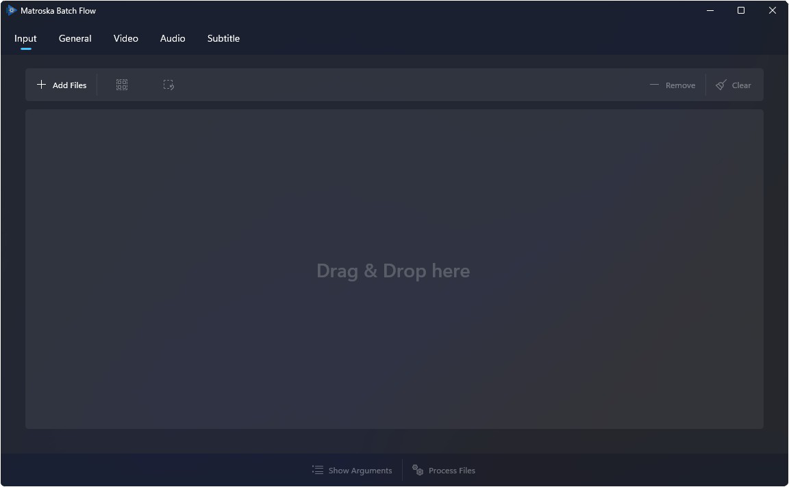

<h1 align="center">
  <a href="https://github.com/TimGels/Matroska-Batch-Flow">
    
  </a>
  <br>
  Matroska Batch Flow
</h1>

<h4 align="center">A powerful tool for batch editing Matroska file properties.</h4>

<p align="center">
  <a href="#what-is-matroska-batch-flow">Introduction</a> •
  <a href="#features">Features</a> •
  <a href="#screenshots">Screenshots</a> •
  <a href="#download">Download</a> •
  <a href="#support-the-project">Support the Project</a> •
  <a href="#development">Development</a> •
  <a href="#contributing">Contributing</a> •
  <a href="#credits">Credits</a> •
  <a href="#license">License</a>
</p>

<div align="center">

[](https://www.gnu.org/licenses/gpl-3.0)
[](https://github.com/TimGels/Matroska-Batch-Flow/releases)

</div>

## Introduction

**Matroska Batch Flow** is a powerful tool for batch processing Matroska (`.mkv`) files, designed to help you efficiently manage and modify large collections. It features a modern graphical user interface built with WinUI 3 and Uno Platform, and integrates [MediaInfo](https://mediaarea.net/en/MediaInfo) for extracting detailed file information, as well as [MKVToolNix's](https://mkvtoolnix.org) mkvpropedit for fast, direct container property editing.

Whether you're an archivist, home theater enthusiast, or anyone who works with Matroska files, Matroska Batch Flow helps you save time and effort. Quickly perform tasks like fixing language tags, updating track names, or preparing files for media servers such as Jellyfin. The tool is suitable for both small batches and large collections, making repetitive editing tasks efficient and ensuring consistency throughout your library.

> [!WARNING]
> This project is currently under active development with no stable release yet. Expect bugs, incomplete features, and breaking changes with pre-release builds.

> [!NOTE]
> Consider [supporting the project](#support-the-project) to help with its continued development.

## Features

| Feature | Description |
| --------- | ------------- |
| **Batch Editing** | Modify container properties (track names, languages, and more) for multiple files at once |
| **Modern GUI** | Intuitive interface built with WinUI 3 and Uno Platform |
| **Drag-and-Drop** | Add files or folders by dragging them into the application |
| **Flexible Validation** | Three configurable strictness levels for file validation (see [Validation Modes](#validation-modes)) |
| **Track Availability Indicators** | Visual indicators showing track coverage across files in your batch |

### Validation Modes

- **Strict Mode** — Enforces consistent track counts and properties across all files *(default)*
- **Lenient Mode** — Allows files with different track counts, with non-blocking notifications
- **Custom Mode** — Configure validation severity per track type and property for maximum control

## Screenshots

<p align="center">
  
</p>

## Support the Project

Matroska Batch Flow is free, open-source software built and maintained in my spare time. I built it to help me reduce the tedious task of spending hours manually fixing track properties across hundreds of files. If this tool has been helpful to you, consider supporting its continued development.

Donations can be made as a one-time donation or a recurring sponsorship. Your support helps cover development time and motivates continued development.

<p align="center">
  <a href="https://github.com/sponsors/TimGels"></a>
  &nbsp;
  <a href="https://buymeacoffee.com/timgels"></a>
</p>

## Download

Pre-release builds are available on the [Releases page](../../releases). Currently, only Windows builds are available. Note that these are early builds and are expected to contain bugs or incomplete features.

## Development

Follow these instructions to set up the project locally for development and testing.

> [!WARNING]
> The cross-platform Skia target (`net10.0-desktop`) is currently experimental and unsupported. Expect bugs, missing features, and platform-specific issues.

### Prerequisites

These prerequisites are required to build the project:

| Requirement | Notes |
| ------------- | ------- |
| **Windows 11** | Required for WinAppSDK target |
| **[.NET 10 SDK](https://dotnet.microsoft.com/download)** | Required for building and running the application |
| **[mkvpropedit](https://mkvtoolnix.download/)** | Already included in WinAppSDK builds |

| Recommended | Notes |
| ------------- | ------- |
| **[Visual Studio 2022 or later](https://visualstudio.microsoft.com/)** | Recommended IDE for development |
| **[Uno Platform Extension for Visual Studio](https://platform.uno/docs/articles/getting-started/installation.html)** | Helps with Uno Platform development |

### Installation

1. Clone the repository:

   ```bash
   git clone https://github.com/yourusername/Matroska-Batch-Flow.git
   cd Matroska-Batch-Flow
   ```

2. Restore dependencies:

   ```bash
   dotnet restore
   ```

3. Build and run (see [Development](#development) for detailed instructions)

### Project Structure

The project is organized as follows:

```bash
Matroska-Batch-Flow/
├── src/
│   ├── MatroskaBatchFlow.Core/                 # Core business logic library
│   ├── MatroskaBatchFlow.Console/              # CLI utility (reserved for future use)
│   └── MatroskaBatchFlow.Uno/                  # WinUI 3 / Skia GUI application
└── tests/
    ├── MatroskaBatchFlow.Core.UnitTests/       # Unit tests for core library
    ├── MatroskaBatchFlow.Uno.UnitTests/        # Unit tests for GUI application
    └── MatroskaBatchFlow.Uno.IntegrationTests/ # Integration tests for GUI application
```

| Project | Purpose |
| --------- | --------- |
| **MatroskaBatchFlow.Core** | Cross-platform core library containing the main business logic of the application |
| **MatroskaBatchFlow.Console** | Command-line interface (reserved for future use) |
| **MatroskaBatchFlow.Uno** | The GUI application powered by Uno Platform. Available targets: WinAppSDK (Windows), Skia Desktop (experimental cross-platform) |

### Building

To build the application, choose one of the following methods:

#### Visual Studio (Recommended)

1. Open `MatroskaBatchFlow.sln` in Visual Studio
2. Set `MatroskaBatchFlow.Uno` as the startup project
3. Select the `net10.0-windows10.0.19041` target framework
4. Press <kbd>F5</kbd> to build and run with debugging

#### Command Line

```powershell
# WinAppSDK (Recommended)
dotnet build src/MatroskaBatchFlow.Uno/MatroskaBatchFlow.Uno.csproj -f net10.0-windows10.0.19041

# Skia Desktop (Experimental)
dotnet build src/MatroskaBatchFlow.Uno/MatroskaBatchFlow.Uno.csproj -f net10.0-desktop
```

### Running

```powershell
dotnet run --project src/MatroskaBatchFlow.Uno/MatroskaBatchFlow.Uno.csproj -f net10.0-windows10.0.19041
```

> [!TIP]
> `dotnet run` automatically builds the project if needed.

### Testing

```powershell
# Run all tests
dotnet test

# Run a specific test project. In this example, the core project unit tests.
dotnet test tests/MatroskaBatchFlow.Core.UnitTests
```

## Contributing

This is a personal project. If you encounter a bug or have a feature suggestion, you're welcome to [open an issue](../../issues), but please ensure it's detailed and actionable. Low-effort submissions (low quality pull requests, vague reports, duplicate issues, feature requests without context) may be closed without action.

## Credits

This project relies on the following tools:

- **[MediaInfo](https://mediaarea.net/en/MediaInfo)** — Media file analysis library
- **[MKVToolNix](https://mkvtoolnix.download/)** — Matroska tools including `mkvpropedit`
- **[Uno Platform](https://platform.uno/)** — Open-source .NET platform for building cross-platform applications
- **[Windows App SDK](https://learn.microsoft.com/windows/apps/windows-app-sdk/)** — Modern Windows development platform

## License

This project is licensed under the **GNU General Public License v3.0** — see the [LICENSE](LICENSE) file for details.
